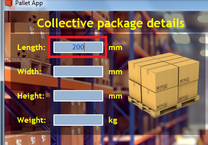
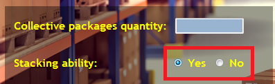
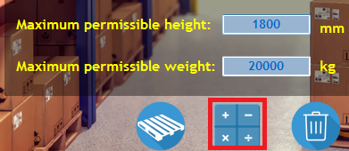
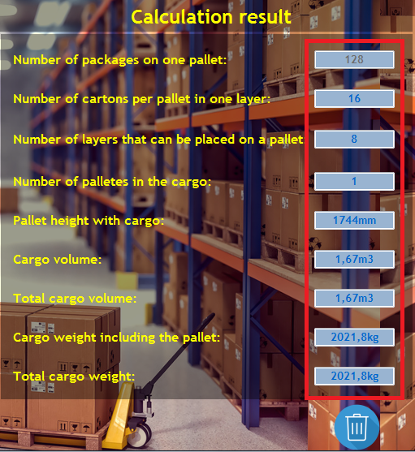

## About Pallet App
### This application was developed to calculate different options of stacking boxes on pallet.

## Used technologies
* C#
* WindowsForms .NET 5.0
* GIMP (Graphics)

## Setup process
##### 1.Download file from:
https://github.com/Bartolem/Pallet-App-repo

##### 2.Click the setup icon.

##### 3.Open Pallet App.

## How to use this application
##### 1.Enter all the data about the box.
> All data must be filled in, otherwise the application will not calculate the result

##### 2. Check the stacking option. 
> This is an important option that has a key impact on how the load is formed on the pallet.

##### 3. Press calculation button.
> Once all data are enter you can run the app by press the calculation button. Make sure the stacking option is checked, otherwise the application will not start.

##### 4. Read the result.
> We will get number of total boxes we can put on pallet, layers, rows, volume and weight based on informations inputed. Also result is limited to maximum weight and height of a pallet.

